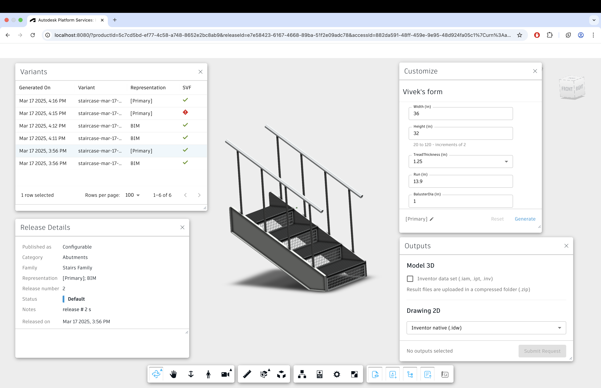
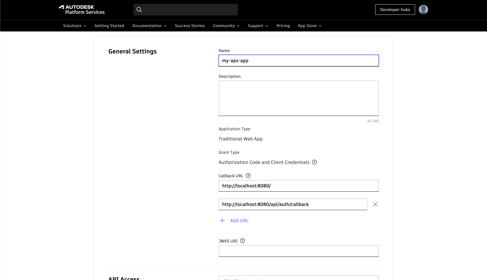
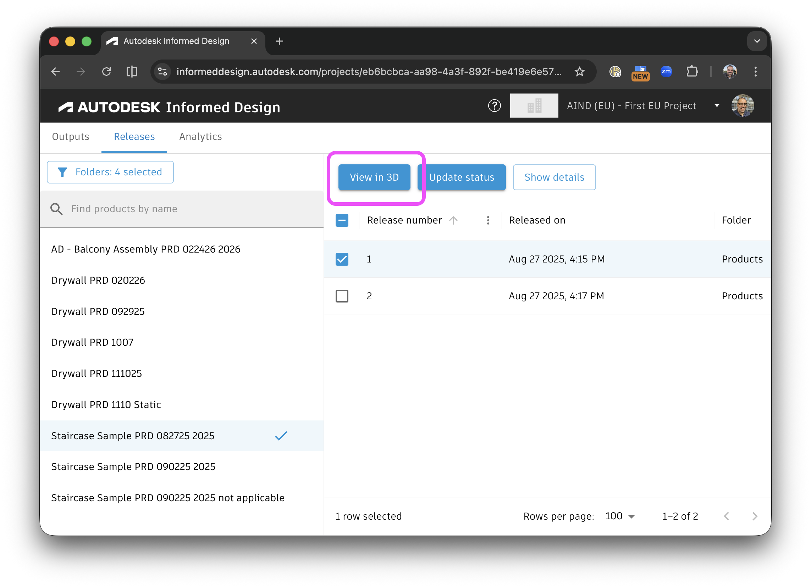
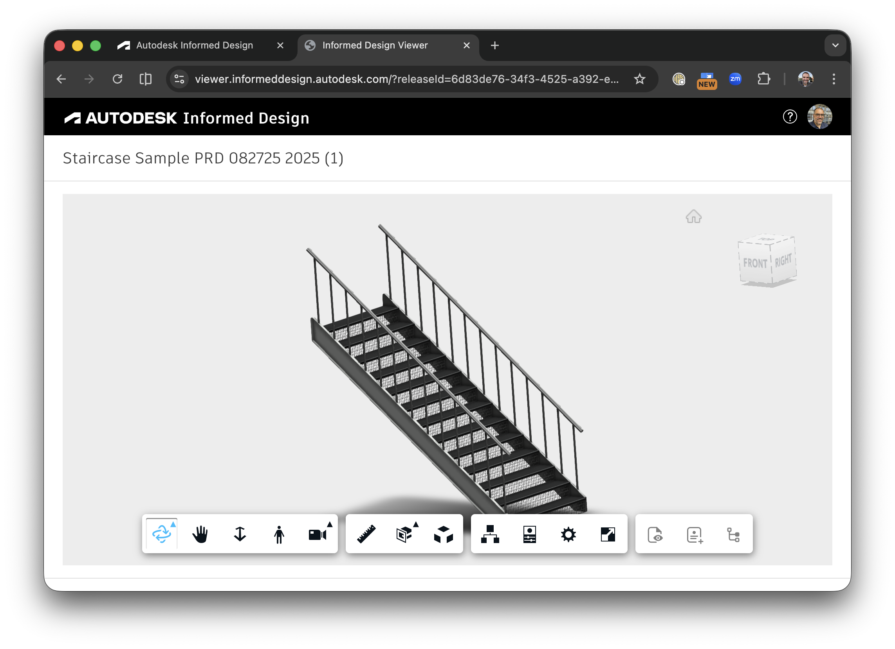
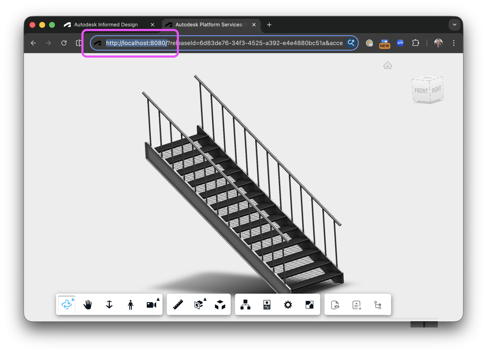

# Informed Design Viewer (Node.js)


[](https://nodejs.org)
[](https://www.npmjs.com/)
[](https://opensource.org/licenses/MIT)

[Autodesk Platform Services](https://aps.autodesk.com) application built by following
the [Simple Viewer](https://tutorials.autodesk.io/tutorials/simple-viewer/) tutorial
from https://tutorials.autodesk.io and [Informed Design Viewer Extension Developer Guide](https://aps.autodesk.com/en/docs/informed-design/v1/developers-guide/viewer/).



## Development

### Prerequisites

- [APS credentials](https://forge.autodesk.com/en/docs/oauth/v2/tutorials/create-app)
  - Once you have created your APS app, add http://localhost:8080/api/auth/callback to the "Callback URL" section of your APS application
    
- [Node.js](https://nodejs.org) (Version 22.*.* is recommended - Long Term Support)
- Command-line terminal such as [PowerShell](https://learn.microsoft.com/en-us/powershell/scripting/overview)
  or [bash](<https://en.wikipedia.org/wiki/Bash_(Unix_shell)>) (should already be available on your system)

> We recommend using [Visual Studio Code](https://code.visualstudio.com) which, among other benefits,
> provides an [integrated terminal](https://code.visualstudio.com/docs/terminal/basics) as well.

### Setup & Run

- Clone this repository: `git clone https://github.com/autodesk-platform-services/aps-informed-design-viewer-nodejs`
- Go to the project folder: `cd aps-informed-design-viewer-nodejs`
- Install Node.js dependencies: `npm install`
- Open the project folder in a code editor of your choice
- Create a _.env_ file in the project folder, and populate it with the snippet below
  - Replace `<client-id>` and `<client-secret>` with your APS Client ID and Client Secret

```bash
APS_CLIENT_ID="<client-id>"
APS_CLIENT_SECRET="<client-secret>"
APS_CALLBACK_URL=http://localhost:8080/api/auth/callback
```

- Run the application, either from your code editor, or by running `npm start` in terminal
- Ok, you are ready to view your first Product using the Informed Design Viewer Extension!
- The app will only load the Autodesk Viewer with an Informed Design product if the correct URL query parameters are provided using 
  ```
  http://localhost:8080?releaseId=<RELEASE_ID>&accessId=<URL_ENCODED_ACCESS_ID>&accessType=<ACCESS_TYPE>
  ```
  - You can find the required values by retrieving the data from the Informed Design API https://aps.autodesk.com/developer/documentation 

> When using [Visual Studio Code](https://code.visualstudio.com), you can run & debug
> the application by pressing `F5`.

## Obtaining the release parameters

There is an easy way to obtain a valid query string using the [Informed Design Web Application](https://informeddesign.autodesk.com/), following these three steps. 

We are considering that you have this sample app running on your `localhost` and listening on the default port `8080`. You will need `Account Admin` or `Project Admin` permissions to perform this procedure.

**Step 1:**  On the Informed Design WebApp, Open the desired Product Release and click on the `View in 3D Button`.



**Step 2:** The selected Product Release will open in a new tab.



**Step 3:** Edit the address bar. Relace the hostname `http://viewer.informeddesign.autodesk.com/` with `http://localhost:8080`. Remember that your local instance is not using an SSL protocol, so don't forget to change the `https://` prefix to ` http://` prefix.



That's it! As long as you are able to visualize the Product Release in the WebApp, you should also be able to visualize the same Product Release with this sample applications, using exactly the same query string.

## Troubleshooting

Please contact us via https://aps.autodesk.com/get-help.

## License

This sample is licensed under the terms of the [MIT License](http://opensource.org/licenses/MIT).
Please see the [LICENSE](LICENSE) file for more details.
